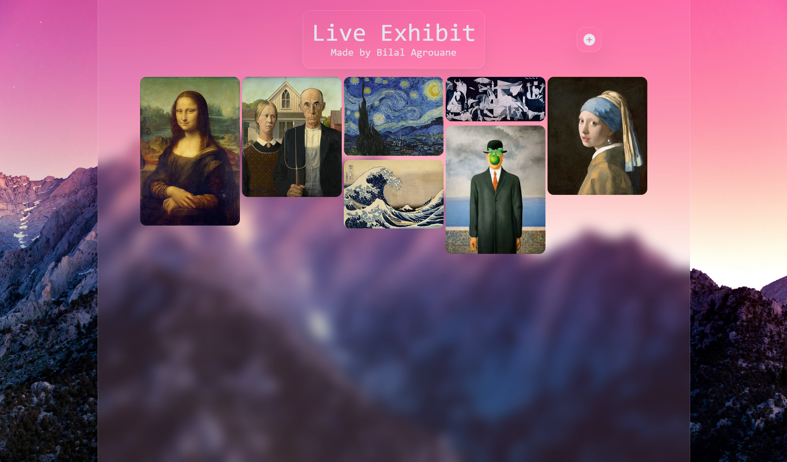

# 🎨 Live Exhibit

A full-stack, mobile-responsive web application where users can seamlessly upload, share, and view digital art. Built with a focus on secure cloud storage, automated content moderation, and a smooth user experience.
 
Link to the Live Demo:https://live-exhibit.vercel.app/
## Tech Stack
* **Frontend:** React, Tailwind CSS
* **Backend & Database:** Supabase (PostgreSQL, Storage Buckets, Edge Functions)
* **Machine Learning:** `nsfwjs` (TensorFlow.js)
* **Security:** Cloudflare Turnstile

## Key Features
* **Responsive Masonry Grid:** A dynamic, Pinterest-style layout that adapts seamlessly to both mobile and desktop screens.
* **Interactive UI:** Hover states reveal image titles and upload timestamps, while a click-to-expand modal provides a detailed view of the artwork.
* **Automated Content Moderation:** Integrates client-side machine learning (`nsfwjs`) to analyze images before upload, preventing inappropriate content from reaching the database and saving server costs.
* **Secure Upload Pipeline:** Utilizes Cloudflare Turnstile for bot mitigation and Supabase Edge Functions to generate signed URLs, ensuring the storage bucket remains protected from unauthorized access.

## Technical Architecture & Challenges Overcome
* **Optimized Upload Flow:** Instead of exposing the Supabase storage bucket directly to the client, the app securely requests a temporary, signed upload URL via an Edge Function. This ensures only validated, human-driven (via Captcha), and ML-approved images are stored.
* **Client-Side ML:** By running the TensorFlow.js NSFW classification model entirely in the browser, the application offloads heavy computation from the server, resulting in a highly scalable and cost-effective moderation system.

## Local Setup & Installation

1. Clone the repository:
   ```bash
   git clone https://github.com/yourusername/your-repo-name.git
   ```
2. Install dependencies:
   ```bash
   npm install
   ```
3. Set up your environment variables. Create a `.env.local` file with the following:
   ```env
   VITE_SUPABASE_URL=your_supabase_url
   VITE_SUPABASE_PUBLISHABLE_KEY=your_supabase_publishable_key
   ```
4. Start the development server:
   ```bash
   npm run dev
   ```

## Future Improvements
* Refine the modal image viewer to enforce stricter aspect-ratio preservation across all screen sizes.
* Implement infinite scrolling or pagination for the masonry grid to handle larger datasets efficiently.
